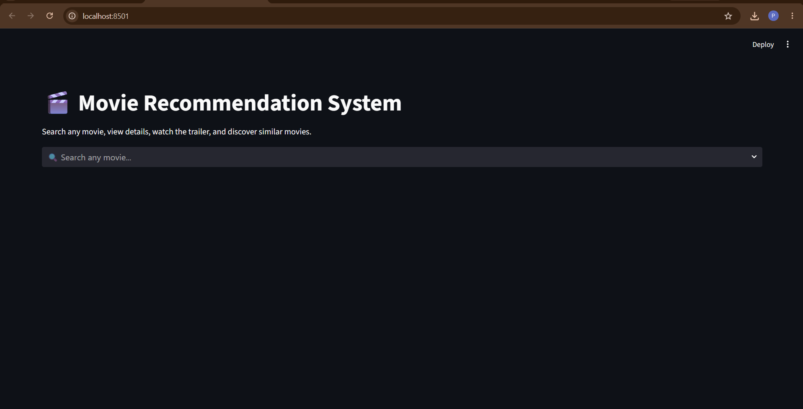

# 🎬 Movie Recommendation System

A Movie Recommendation System built using Streamlit, Machine Learning, and OMDb API.

## Features

- Movie Search
- Search-as-you-type
- Movie Details
- IMDb Ratings
- Posters
- Trailer
- Similar Movie Recommendations
- Wikipedia Link
- Watch Online Link

# 📸 Application Screenshots

## 🏠 Home Page

---

## 🎬 Movie Details

---

## 🎯 Recommendations

## Tech Stack

- Python
- Streamlit
- Scikit-Learn
- Pandas
- OMDb API

## Dataset

TMDB 5000 Movies Dataset

## Installation

pip install -r requirements.txt

streamlit run app.py
